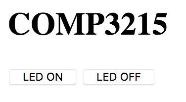

# KW41Z USB web server

## mbed Library

A PPP example application and library can be found [here](https://os.mbed.com/users/nixnax/code/PPP-Blinky/).

### HTML
The web page to be loaded by the KW41z is shown below. Pressing the *LED ON* button sends a POST request with `button=1`. Conversely with *LED OFF* the it sets `button=0`.
```html
<html>
    <head><title>A simple Web Server</title></head>
    <body>
        <h1>COMP3215</h1>
        <form action="" method="post">
            <button name="button" value='1'>LED ON</button>
            <button name="button" value='0'>LED OFF</button>
        </form>
    </body>
</html>
```


### Extracting the button value

In lines 893-894 in the `httpResponse()` function, the value of `button` is extracted using `strstr()`.

```c
...
httpGetLedOff = strstr(dataStart,"button=0");
httpGetLedOn  = strstr(dataStart,"button=1");
...
```

At the bottom of the response handler the LED state is then handled (lines 943-953).

```c
...
if(httpGetLedOn) {
    // put something here to send RF to turn on LED
    led1 = 0;
    memcpy(n+dataStart,body,sizeof(body));
    n = n + sizeof(body)-1; // one less than size
} else if(httpGetLedOff) {
    // put something here to send RF to turn off LED
    led1 = 1;
    memcpy(n+dataStart,body,sizeof(body));
    n = n + sizeof(body)-1; // one less than size
}
...
```

After setting the state of the LED, the webpage is then reserved to the host.
